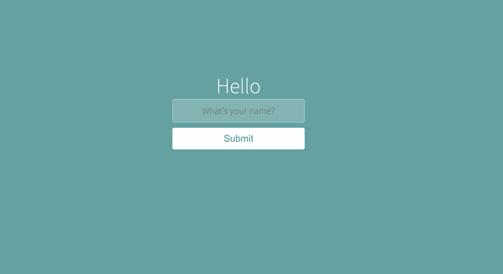

# Appbrewery - React Event Handling Solution

This is a React Project from Appbrewery.com for leaning event handling in react

## Table of contents

- [Overview](#overview)
  - [The challenge](#the-challenge)
  - [Screenshot](#screenshot)
- [My process](#my-process)
  - [Built with](#built-with)
  - [What I learned](#what-i-learned)
- [Author](#author)

## Overview

### The challenge

Users should be able to:

- Build interactive forms
- Use different mouse functions

### Screenshot

## My process

### Built with

- Semantic HTML5 markup
- CSS custom properties
- JavaScript
- React

### What I learned

Using React components to build interactive forms

## Author

- Twitter - [@sanjayvjacob](https://www.twitter.com/sanjayvjacob)
